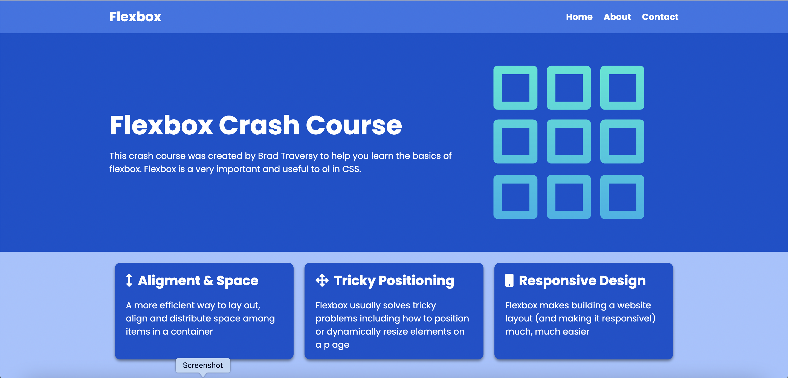

# Webpage with flexbox

Responsive webpage using HTML5 and CSS3 to practice CSS flexbox.

## Screenshots

## Acknowledgements

 - [Based on tutorial](https://www.youtube.com/watch?v=3YW65K6LcIA)
# Hi, I'm Hanna! 👋

## 🚀 About Me
I'm a front-end developer.

## 🛠 Skills
Javascript, HTML5, CSS3...
